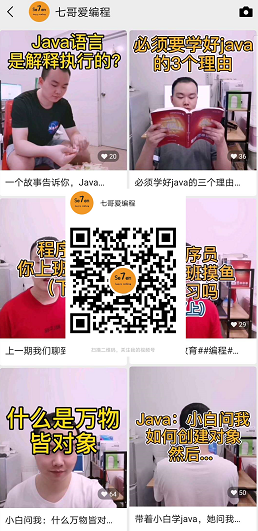

# 关于作者
1. hello，我是七哥，90后互联网程序员；
2. 深耕金融领域4年+，从事 Java 后台开发岗位；
3. 爱编程、爱理财、爱分享；
4. 对技术有热情，同时也努力能提升认知，扩展不同的圈子；
5. 公众号 & 视频号 & CSDN同名，都是 **七哥爱编程**；

# 关于这个项目

1. CSDN博客地址：[https://blog.csdn.net/taurus_7c](https://blog.csdn.net/taurus_7c)
2. 公众号 & 视频号 & CSDN同名，都是 **七哥爱编程**；
3. 所有博客的汇总，博客中涉及的代码和文件资料，方便大学查阅；

# 文章目录
> 总体规划是包涵下面这些方面，如果有你感兴趣的内容，希望持续关注，或者留言沟通，我将不胜感激。

Java并发、JVM、Spring、Spring Boot、Mybatis、Linux、MySQL、Redis、数据结构&算法、Docker、大数据

## Java领域

### Java并发

